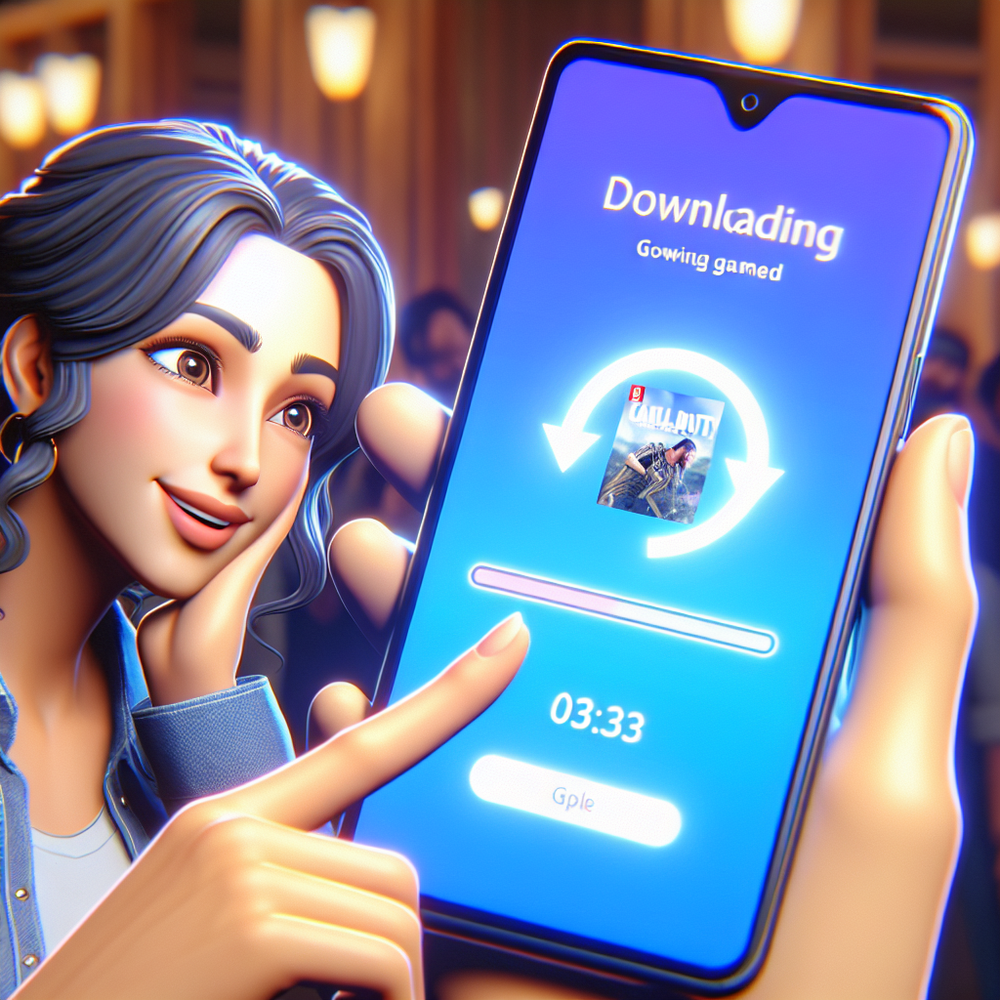
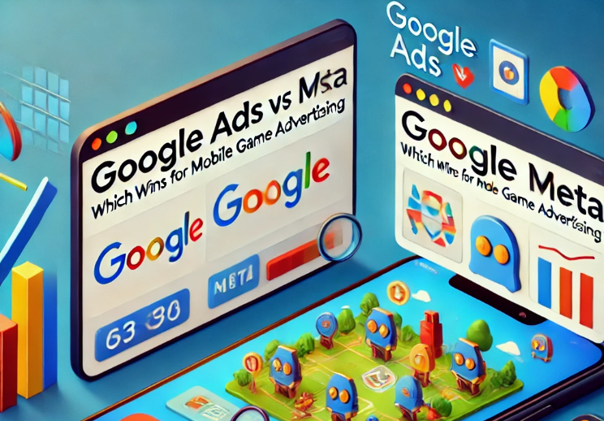
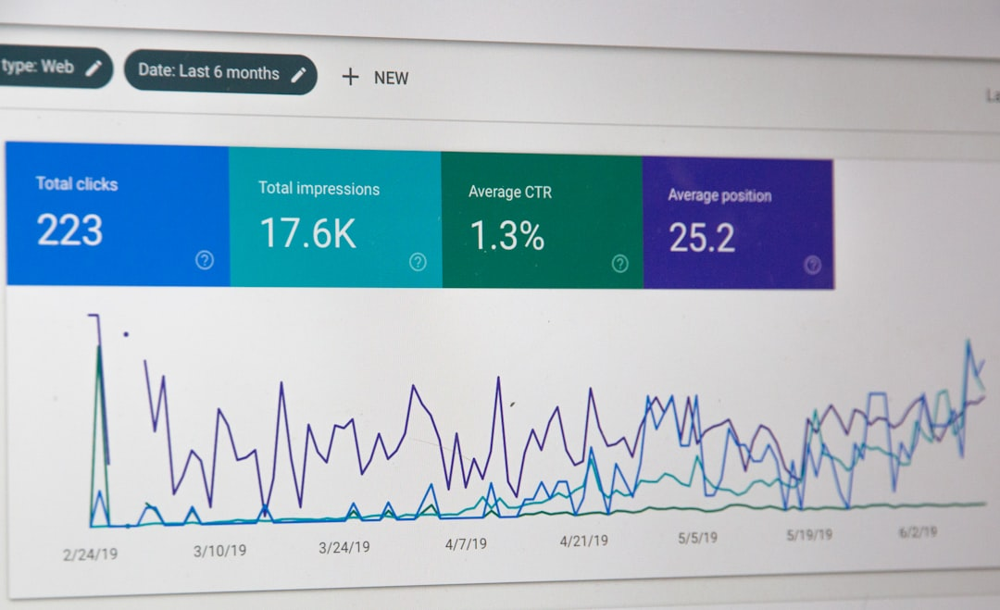
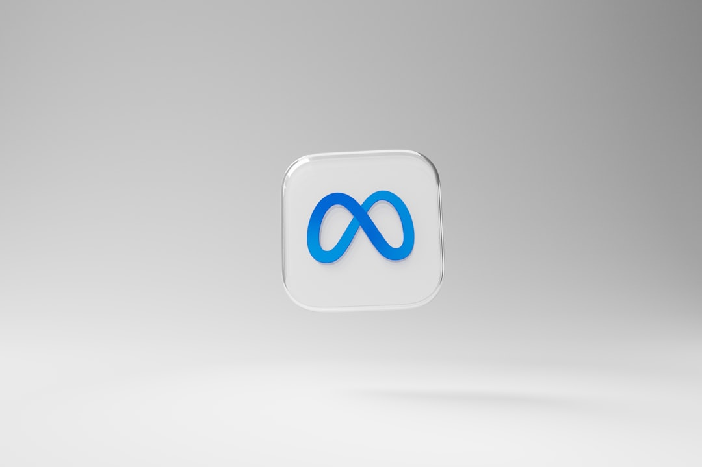
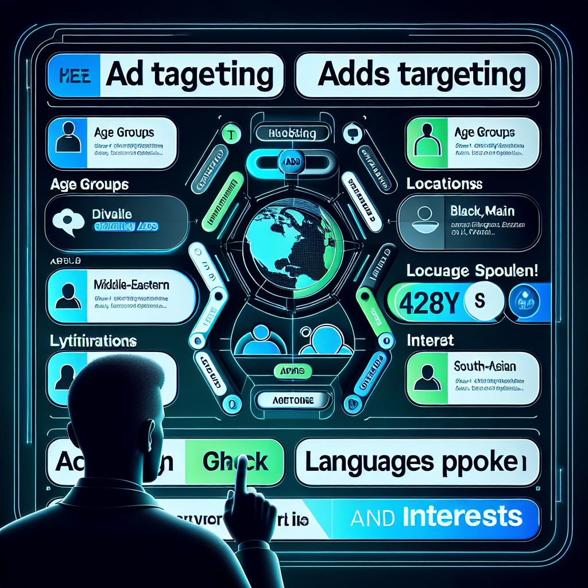
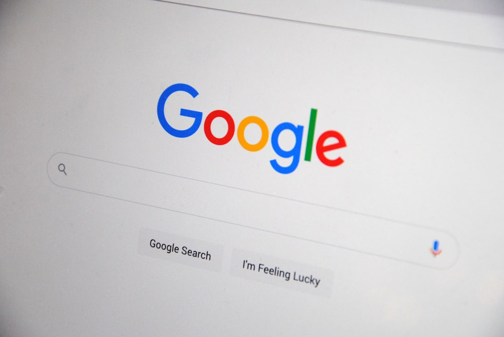
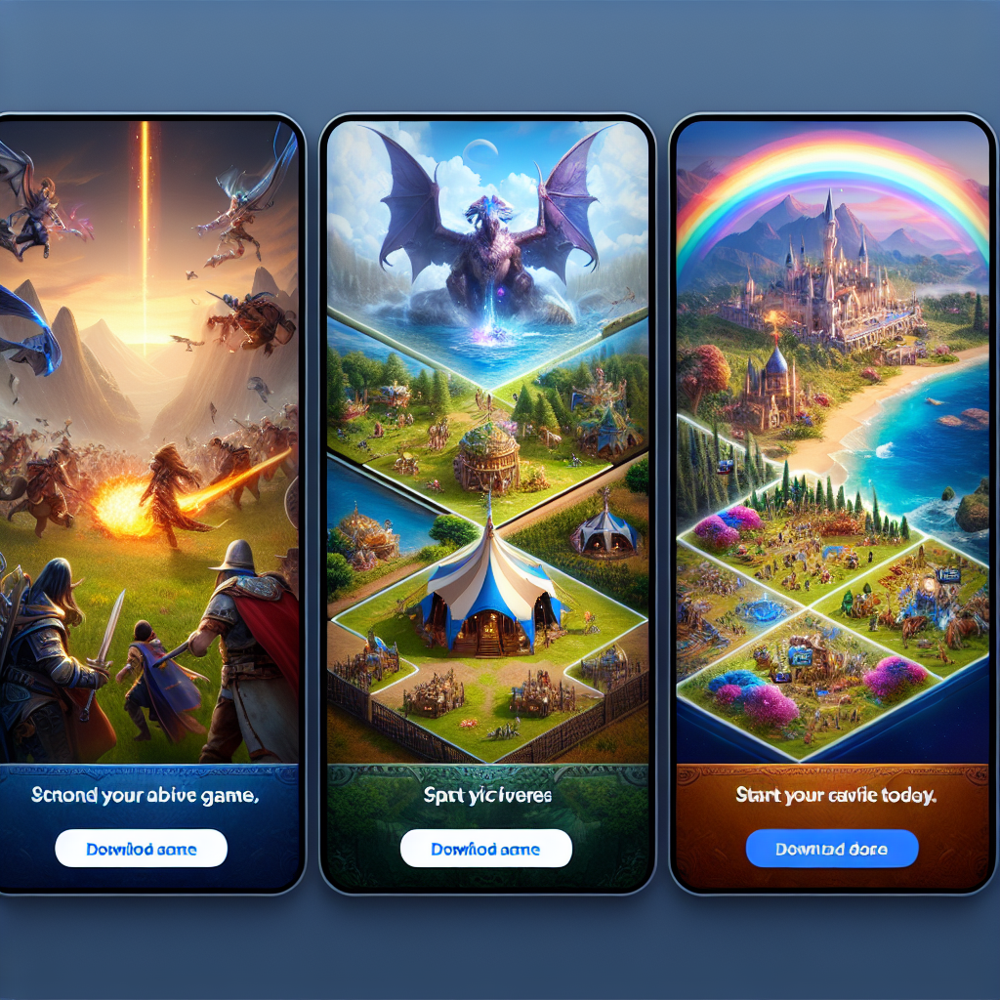

# September 2024 - Ramiz Trtovac

[8 800 2563 123](tel:+88002534236)

[contact@ramiztrtovac.com](mailto: contact@ramiztrtovac.com)

Twitter

Facebook-f

Google-plus-g

Pinterest-p

Linkedin-in

* [Home](https://ramiztrtovac.com/)
* [About Me](https://ramiztrtovac.com/about-me/)
* [Blog](https://ramiztrtovac.com/blog/)
* [Contact Me](https://ramiztrtovac.com/contact-me/)

Search

# September 2024

[Home](https://ramiztrtovac.com/)[2024](https://ramiztrtovac.com/2024/)  September

[](https://ramiztrtovac.com/useraquisition/user-acquisition-for-mobile-games/)

September 19, 2024by [Ramiz Trtovac](https://ramiztrtovac.com/author/admin/)[User Acquisition](https://ramiztrtovac.com/category/useraquisition/)

## [What is User Acquisition for Mobile Games?](https://ramiztrtovac.com/useraquisition/user-acquisition-for-mobile-games/)

In mobile gaming, success hinges on one crucial factor: user acquisition.

But what exactly is user acquisition for mobile games?

Simply put, it’s attracting and converting users to download and play your game. It’s a critical part of mobile game marketing, and it’s not as simple as it sounds.

There are numerous strategies involved, from organic methods to paid promotions. Each has its own set of challenges and benefits.

This comprehensive guide aims to shed light on this complex process. It’s designed for game developers, marketers, and publishers looking to boost their user acquisition efforts.

Whether you’re a seasoned professional or a newcomer to the industry, you’ll find valuable insights here.

So, let’s dive into the fascinating world of user acquisition for mobile games.

## Understanding User Acquisition in Mobile Gaming

User acquisition is a cornerstone of mobile game marketing. It’s the process of attracting new users to download and play your game.

But it’s not just about getting downloads.

The goal is to acquire high-quality users. These are players who engage with your game regularly, make in-app purchases, and become loyal fans.

User acquisition involves a mix of marketing strategies. These can range from app store optimization to social media campaigns, influencer partnerships, and paid advertising.

The key is to understand your target audience and tailor your strategies to attract and engage them effectively.

### The Importance of User Acquisition for Mobile Games

User acquisition is vital for the success of any mobile game. It’s the fuel that drives growth and more revenue for your mobile game.

Without a steady stream of new users, a game can quickly stagnate. It’s not enough to create a great game; people need to know about it and play it.

That’s where user acquisition comes in. It’s about showing your game to possible players, getting them to download it, and turning them into active users.

### Organic vs. Paid User Acquisition

There are two main types of user acquisition: organic and paid.

Organic user acquisition refers to users who find and download your game on their own. This can happen through word-of-mouth, social media shares, or app store searches.

Paid user acquisition, on the other hand, involves spending money to attract users. This can be through paid ads, influencer partnerships, or other promotional activities.

1. Organic User Acquisition: Word-of-mouth, social media shares, app store searches
2. Paid User Acquisition: Paid ads, influencer partnerships, promotional activities

by CDC (https://unsplash.com/@cdc)

Both methods have their pros and cons. Organic acquisition is cost-effective but can be slow and uncertain.

. Paid advertising can give fast results, but it can cost a lot. It needs careful planning to make sure you get good value for your money.

The best approach often involves a balanced mix of both organic and paid strategies.

## Strategies for Effective User Acquisition

Effective user acquisition requires a well-planned strategy. It’s not just about reaching as many people as possible, but reaching the right people.

Understanding your target audience is crucial. You need to know their interests, habits, and preferences to tailor your marketing efforts effectively.

by Ryoji Iwata (https://unsplash.com/@ryoji\_\_iwata)

A successful user acquisition strategy also involves testing and optimization. This means trying out different tactics, measuring their performance, and refining them based on the results.

It’s also important to consider the user acquisition funnel. This is the journey a user takes from first hearing about your game to becoming an active player.

Each stage of the funnel requires a different approach. Awareness strategies could use big ads, while conversion strategies could highlight what makes your game special.

### Optimizing the User Acquisition Funnel

The user acquisition funnel is a key concept in mobile game marketing. It represents the user’s journey from awareness to download and engagement.

Each stage of the funnel requires a different strategy. For example, to raise awareness, you might use social media ads or influencer partnerships.

To encourage downloads, you might focus on app store optimization or offer special promotions. Understanding and optimizing this funnel is crucial for effective user acquisition.

### Leveraging App Store Optimization (ASO)

App Store Optimization (ASO) is a key strategy for user acquisition. It involves optimizing your game’s listing on the app store to improve its visibility.

This includes choosing the right keywords, creating an engaging description, and using compelling screenshots and videos.

by Jonathan Petersson (https://unsplash.com/@grizzlybear)

User ratings and reviews also play a significant role in ASO. Positive reviews can boost your game’s ranking in the app store, making it more visible to potential users.

Therefore, encouraging users to leave reviews and promptly addressing any issues they raise can significantly enhance your ASO efforts.

### Utilizing Mobile Advertising Networks

Mobile advertising networks are a powerful tool for user acquisition. They allow you to display ads for your game across a wide range of apps and websites.

This can significantly increase your game’s visibility and reach. However, it’s important to carefully select the networks you use and monitor the performance of your ads.

Poorly performing ads can drain your budget without delivering results. Therefore, regular testing and optimization are crucial when using mobile advertising networks.

### Engaging with Social Media and Influencers

Social media platforms offer a wealth of opportunities for user acquisition. They allow you to engage directly with potential users, build a community around your game, and create shareable content.

Influencer marketing can also be highly effective. By working with influencers who are popular with your target audience, you can connect with many potential users in a trustworthy and interesting way.

by Alexander Shatov (https://unsplash.com/@alexbemore)

However, it’s important to choose influencers who align with your game’s brand and values. Their endorsement should feel authentic to their audience, or it may not have the desired impact.

## Measuring Success: Analytics and KPIs

Measuring the success of your user acquisition efforts is crucial. It helps you understand what’s working and what’s not, allowing you to refine your strategies.

Analytics tools can provide valuable insights into your user acquisition performance. They can show you where your users are coming from, how they’re interacting with your game, and much more.

by Campaign Creators (https://unsplash.com/@campaign\_creators)

Key Performance Indicators (KPIs) are specific metrics that you track to measure success. These might include the number of new users, the cost per install, or the retention rate.

Choosing the right KPIs depends on your specific goals. For example, if your goal is to maximize revenue, you might focus on the average revenue per user.

### Key Performance Indicators for User Acquisition

There are many KPIs you can track for user acquisition. One of the most common is the Cost Per Install (CPI). This measures how much you’re spending to acquire each new user.

Another important KPI is the retention rate. This measures how many users continue to play your game after a certain period.

High retention rates indicate that your game is engaging and satisfying to users. On the other hand, a low retention rate might suggest that users are losing interest quickly.

### Analyzing User Acquisition Data

Analyzing user acquisition data can provide valuable insights. For example, you might discover that certain marketing channels are more effective than others.

You might also find that certain types of users are more likely to become long-term players. This can help you refine your targeting and messaging.

However, it’s important to remember that data is just one piece of the puzzle. It’s also crucial to listen to user feedback and stay attuned to changes in the market.

## Retention and Engagement Post-Acquisition

Once you’ve acquired new users, the next challenge is to keep them engaged. Retention and engagement are key to the long-term success of your mobile game.

High retention rates indicate that your game is satisfying and engaging to users. It also suggests that your user acquisition efforts are paying off.

by Djim Loic (https://unsplash.com/@loic)

However, maintaining high retention rates can be challenging. It requires continuous effort to keep your game fresh and interesting.

This might involve releasing regular updates, adding new content, or running special events.

### Best Practices for Maintaining a High Retention Rate

One of the best ways to maintain a high retention rate is to listen to your users. This might involve conducting surveys, monitoring user reviews, or engaging with your community on social media.

Another effective strategy is to reward loyalty. This could mean giving rewards to players who stick around a long time or having special events for your most loyal fans.

Finally, it’s important to keep your game fresh and interesting. Regular updates, new content, and special events can all help to keep users engaged.

### Re-engaging Lapsed Users

Even with the best retention strategies, some users will inevitably stop playing your game. However, this doesn’t mean they’re lost forever.

Re-engaging lapsed users can be a cost-effective way to boost your user base. This might involve sending push notifications, offering special promotions, or running re-engagement campaigns.

However, it’s important to approach re-engagement with care. Sending too many messages to users can be unhelpful. Instead, aim to provide value and remind users why they loved your game in the first place.

## Future Trends and Emerging Technologies in User Acquisition

The landscape of user acquisition for mobile games is constantly evolving. New technologies and market trends are always reshaping the strategies and tactics used by game developers and marketers.

For instance, machine learning and artificial intelligence are becoming increasingly important in optimizing user acquisition campaigns. These technologies can help to analyze user behavior, predict trends, and automate decision-making.

At the same time, data privacy regulations are becoming more stringent. This is forcing game developers and marketers to rethink their user acquisition strategies and prioritize user privacy.

### The Role of Emerging Technologies

Emerging technologies like machine learning and artificial intelligence are playing an increasingly important role in user acquisition. They can help to analyze vast amounts of data, identify patterns, and make predictions.

For instance, machine learning algorithms can be used to predict which users are most likely to engage with your game. This can help to target your user acquisition efforts more effectively.

Artificial intelligence can also be used to automate decision-making. This can help to optimize your user acquisition campaigns in real-time, maximizing efficiency and ROI.

### Adapting to New Market Realities

The mobile gaming market is constantly evolving. New trends and market realities are constantly emerging, forcing game developers and marketers to adapt their user acquisition strategies.

For instance, the rise of hyper-casual games has reshaped the mobile gaming landscape. These games are typically easy to play and highly addictive, attracting a broad range of users.

At the same time, data privacy regulations are becoming more stringent. This is forcing game developers and marketers to prioritize user privacy and rethink their user acquisition strategies.

## Conclusion: The Continuous Evolution of User Acquisition

In conclusion, user acquisition for mobile games is a dynamic and evolving field. It requires a deep understanding of the gaming market, user behavior, and the latest technologies and trends.

Successful user acquisition is not a one-time effort but a continuous process of testing, learning, and optimizing. By staying informed about the latest trends and best practices, game developers and marketers can ensure their games continue to attract and retain a large and engaged user base.

## **Unlock More Success in Game Growth!**

Are you ready to take your game marketing to the next level? Get my exclusive E-book guide designed specifically for game developers, indie developers, and small gaming companies! This comprehensive resource offers actionable steps and guidance that will help you better understand the User Acquisition world and drive more installs to your mobile game. Click [HERE](https://ramiztrtovac.gumroad.com/l/useracquisitionunlocked) to learn more and get your copy of User Acquisition: Unlocked! E-book!

[Read More](https://ramiztrtovac.com/useraquisition/user-acquisition-for-mobile-games/)

[Share](javascript:void(0))

[](https://ramiztrtovac.com/useraquisition/mobile-game-advertising-google-or-meta-which-wins/)

September 13, 2024by [Ramiz Trtovac](https://ramiztrtovac.com/author/admin/)[User Acquisition](https://ramiztrtovac.com/category/useraquisition/)

## [Mobile Game Advertising: Google or Meta? Which Wins?](https://ramiztrtovac.com/useraquisition/mobile-game-advertising-google-or-meta-which-wins/)

Advertising your mobile game can be complex, but picking the right platform can make a big difference. Google Ads and Meta (formerly Facebook) Ads are two of the most popular choices for mobile game advertising. Both platforms offer unique features and advantages, but which one works best for mobile games? Based on my experience scaling various mobile games on both platforms, let’s dive into a detailed comparison.

## Understanding the Basics

Before we delve into the specifics, it’s important to understand what each platform offers.

### Google Ads

Google Ads provides a vast network that includes Google Search, YouTube, and the Google Display Network (GDN). With Google Ads, you can reach users through search ads, video ads, and display ads. Google’s machine learning tools make your campaigns work better.

Google is huge. It gets billions of searches and video views on YouTube every day.

This means your mobile game can be seen on many sites. It helps you reach users in various places. Plus, using Google Analytics gives you details on user behavior. This helps you make your campaigns better for greater success.

by Stephen Phillips – Hostreviews.co.uk (https://unsplash.com/@hostreviews)

Google Ads also offers powerful tools like automated bidding strategies and responsive ads. Automated bidding sets the best bids for each auction to get good results. Responsive ads change their size and look to fit different ad spaces. These features make it easier to manage and optimize your campaigns.

### Meta Ads

Meta Ads use their popular apps Facebook, Instagram, Messenger, and the Audience Network to showcase your ads. Meta’s targeting options let you reach specific demographics, interests, and behaviors. With the ability to create engaging visual ads,

Meta Ads is a strong choice for mobile game advertising. Meta’s platforms emphasize visuals, helping mobile games showcase their gameplay and graphics. Whether through video ads or interactive carousel ads, Meta Ads can capture user attention effectively.

Meta’s Audience Network helps you reach more people. Your ads can show up on other apps and websites, not just on Meta’s platforms.

by Dima Solomin (https://unsplash.com/@solomin\_d)

Meta Ads also provide robust analytics and reporting tools. These tools show how well your ads are doing. They provide details like how many people click on your ads, how much you pay for each install, and how many clicks lead to a in-app purchase. This data is important for making your campaigns better and getting the most value for your money.

### Comparing Basic Features

Both platforms offer unique strengths in their basic features.

Google Ads works well with other Google services and can reach many people. This is a strong tool for targeting users in different situations.

Meta Ads has strong visual and interactive formats. It also targets users well. This makes it great for getting people to engage and make purchases.

## Targeting Capabilities

### Google Ads Targeting

Google Ads offers various targeting options, including keywords, demographics, interests, and remarketing. One of the key strengths of Google Ads is its intent-based targeting. When people search for games like yours, your ad can show up. This helps reach users who want to find new games to play.

Intent-based targeting is particularly effective for capturing high-quality players. Users who search for terms related to your game are already interested in finding new games, making them more likely to convert. Google’s remarketing helps you reach users who have seen your ads, visited your website or played your old game. This can boost the chances of getting them to take action and convert.

by The Average Tech Guy (https://unsplash.com/@the\_average\_tech\_guy)

Google Ads also offers advanced targeting features like custom intent audiences and similar audiences.

Custom intent audiences let you focus on users based on their recent searches.

Similar audiences help you find new users who are like your current customers.

These features can help you target better and make your campaigns work well.

### Meta Ads Targeting

Meta Ads excel in demographic and interest-based targeting. You can create custom audiences based on user behavior, interests, and even lookalike audiences. This is very helpful for mobile games. You can reach users who like similar games.

The ability to create highly specific audience segments is one of Meta’s key strengths. You can focus on users who like mobile gaming pages, play similar games, or are interested in related topics. This level of detail level allows you to reach users who are more likely to be interested in your game.

Meta’s lookalike audiences are another powerful tool. You can find new users like your best customers by creating lookalike groups from your current users. This can greatly help you find good leads and make more sales.

### Combining Targeting Options

Both platforms have strong targeting options. Your choice depends on what you want to achieve. If you want to capture users with high intent, Google Ads is your best bet. If you want to promote your mobile game and reach precisely targeted people, Meta Ads has great tools for you.

Using both platforms together can be very helpful.

You can use Google Ads to reach people who really want to convert through huge Google AdNetwork.

You can use Meta Ads to help more people know about your mobile game and convert them into players.

This multi-channel approach can help you reach more people and drive more conversions.

## Ad Formats

by Redd F (https://unsplash.com/@raddfilms)

### Google Ads Formats

Google Ads offers a range of formats, including:

* **Search Ads:** Text-based ads that appear on Google search results.
* **Display Ads:** Banner ads that appear on websites within the Google Display Network.
* **Video Ads:** Ads that play before, during, or after YouTube videos.
* **Universal App Campaigns (UAC):** Automated campaigns that run across Google’s properties to drive app installs.

**Search Ads** are particularly effective for capturing users who are actively searching for new games. These text-based ads appear at the top of search results, making them highly visible to users with high intent. **Display Ads**, on the other hand, are great for building brand awareness and reaching users across a wide range of websites.

by sarah b (https://unsplash.com/@sixthcitysarah)

**Video Ads** on YouTube are another powerful format. These ads can showcase gameplay, features, and other aspects of your game in an engaging manner. Universal App Campaigns (UAC) are great for getting more app installs. They use Google’s smart technology to make your ads work better.

### Meta Ads Formats

Meta Ads also offer diverse ad formats, such as:

* **Image Ads:** Static images that appear in users’ feeds.
* **Video Ads:** Engaging videos that can showcase gameplay.
* **Carousel Ads:** Multiple images or videos in a single ad unit.
* **Playable Ads:** Interactive ads that allow users to try the game before downloading.

**Image Ads** are a simple yet effective way to capture user attention. These static images appear in users’ feeds and can be used to highlight key aspects of your game.

**Video Ads** are even more engaging, allowing you to showcase gameplay, features, and other elements in a dynamic format.

**Carousel Ads** offer a unique way to present multiple images or videos in a single ad unit. This format is particularly useful for highlighting different features or levels of your game.

**Playable Ads** are perhaps the most engaging format, allowing users to try your game before downloading it. This interactive experience can significantly increase user interest and drive more installs.

### Choosing the Right Formats

For mobile games, interactive and visual formats can be particularly effective. Meta Ads’ playable and video ads are excellent for showcasing gameplay and engaging users. Google’s UAC is also highly effective for driving installs through automated optimization.

Using a mix of different ad formats can help you reach a wider audience and keep your ads fresh and engaging. For example, you can use video ads to capture user interest, followed by playable ads to give users a taste of your game. This method can help you get more people involved and increase installs.

## Cost and ROI

### Google Ads Cost

Google Ads operates on a pay-per-click (PPC) model. The cost can vary greatly based on competition, targeting, and ad quality. Generally, Google Ads can be more expensive due to the competitive nature of search ads.

The PPC model means you pay only when someone clicks your ad. This makes it a budget-friendly option if your campaign is set up well. However, the cost per click (CPC) can be high, especially for competitive keywords.

This can affect your budget and profits. So, it’s important to manage your bids and targets carefully.

by Micheile Henderson (https://unsplash.com/@micheile)

Google Ads also offers tools like automated bidding and cost-per-acquisition (CPA) bidding. These tools can help you optimize bids and control costs better. Setting a target CPA means you only pay for conversions that match your budget.

### Meta Ads Cost

Meta Ads use a cost-per-impression (CPM) model but can also be optimized for clicks or conversions. The cost tends to be lower compared to Google Ads, making it a cost-effective option for reaching a large audience.

The CPM model means you pay for every 1,000 impressions, regardless of whether users click on your ad. This can be a more cost-effective option if you’re looking to build brand awareness and reach a broad audience. Additionally, Meta Ads can be optimized for clicks or conversions, allowing you to focus on specific campaign goals.

by Campaign Creators (https://unsplash.com/@campaign\_creators)

This information is important for making your campaigns better. It helps you get the most value for your money. You can make your campaigns better by checking key numbers like CPC, conversion rates, and cost per conversion. This helps you get better results for less money.

### Comparing Costs and ROI

When thinking about costs and returns, Meta Ads usually give a better return for mobile games. This is because they are cheaper and have fun ad formats. On the other hand, Google Ads can reach higher value users who are more likely to make a more purchases.

Balancing your budget between both platforms can help you achieve the best results. You can use Meta Ads to reach many people for less money. Use Google Ads to get users who are more likely to buy. This method can help you save money and increase your returns.

## Scaling Campaigns

by Kelly Sikkema (https://unsplash.com/@kellysikkema)

### Google Ads Scale Potential

Google Ads offers robust tools for scaling campaigns. With features like automated bidding and audience targeting, you can easily expand your reach. Google’s machine learning tools keep improving your ads to make them work better over time.

Automated bidding strategies like target CPA and target ROAS can help you improve and scale your campaigns.

These strategies use machine learning to change your bids. They help you meet your campaign goals and get better results.

Additionally, Google’s audience targeting options let you expand your reach by targeting similar and custom audiences.

by Firmbee.com (https://unsplash.com/@firmbee)

Google Ads also offers tools like responsive search ads and dynamic search ads.

Responsive search ads change their format to fit different ad spaces. Dynamic search ads use your website content to make relevant ads for users. These tools can help you grow your campaigns better. They make sure your ads are always interesting and useful.

### Meta Ads Scale Potential

Meta Ads also provide excellent scale potential. The platform’s lookalike audiences and automated optimization tools allow you to reach new users efficiently. Meta’s analytics help you see which campaigns are doing best, so you can use your budget wisely.

Lookalike audiences are useful for scaling your campaigns. Make lookalike groups from your current users. This helps you find new users like your best customers. This can help you reach more people and get more sales.

by Jeremy Bishop (https://unsplash.com/@jeremybishop)

Meta Ads offers automated optimization tools, like automatic placements and campaign budget optimization. Automatic placements put your ads in the best places on Meta’s platforms. Campaign budget optimization helps distribute your budget to your best ad sets. These tools can help you grow your campaigns easily and make more money.

### Comparing Scale Potential

Regarding scale potential, both Google Ads and Meta Ads provide good options for gaming companies that want to expand their reach. Google Ads stands out with its automated features, making it easier to manage large campaigns. These tools help advertisers set better bids, change targets, and manage budgets. They make it easier to handle large projects.

Meta Ads offers clear analytics and advanced targeting options. This helps advertisers see how their campaigns are doing. These tips help gaming companies know their audience better and make their plans better.

Using both platforms can enhance advertising efforts. By using the strengths of both, game developers and studios can reach more people and create better campaigns that use the special benefits of each service.

You can use Google Ads’ automatic tools to spend your money on different keywords. You can use Meta Ads to reach groups of people with specific interests.

This plan makes your ad spending better. It enhances the effectiveness of your campaign, attracts more attention, and increases sales.

### Conclusion

Picking the best platform for mobile game ads—**Google Ads vs. Meta Ads**—depends on what you want to achieve and who your audience is. Both platforms offer unique advantages that can be leveraged to reach the right users and drive conversions.

* **Google Ads** excels at targeting users with high intent. Through search ads, remarketing, and its vast network that includes YouTube and Google Display Network (GDN), you can reach users across various platforms. Automated bidding and machine learning improve campaigns, but costs can go up because search ads are very competitive.
* **Meta Ads**, on the other hand, shine with their strong demographic and interest-based targeting, visual ad formats, and cost-effective reach. The platform can make lookalike audiences and has playable ads. This helps mobile game advertisers connect with users in an exciting way. It usually results in lower costs and better returns on their investment.

### 

### Key Takeaways

1. **Targeting**: Google’s intent-based targeting finds strong leads. Meta’s interest-based targeting reaches gamers well.
2. **Ad Formats**: Google’s Search and Video Ads are great for reaching people ready to buy. Meta’s formats, like Carousel and Playable Ads, help engage users more.
3. **Cost**: Meta Ads usually give a better return on investment at a lower cost. However, Google Ads can reach users who are ready to buy, which makes it great for campaigns focused on performance.
4. **Scaling**: Both platforms have good tools for growing your audience. Google’s machine learning and Meta’s lookalike audiences have unique benefits based on your approach.

Using a mix of both platforms might give the best results. This combines Google’s wide reach and intent-driven tools with Meta’s engaging and affordable formats. This two-platform plan helps you reach more people and connect with the right users at the right moment. This can lead to more app installs and purchases.

## Unlock More Success in Game Growth!

Are you ready to take your game marketing to the next level? Get my exclusive E-book guide designed specifically for game developers, indie developers and small gaming companies! This comprehensive resource offers actionable steps and guidance that will help you understand User Acquisition world better, and drive more installs to your mobile game. Click [HERE](https://ramiztrtovac.gumroad.com/l/useracquisitionunlocked) to learn more and get your copy of User Acquisition: Unlocked! E-book!

[Read More](https://ramiztrtovac.com/useraquisition/mobile-game-advertising-google-or-meta-which-wins/)

[Share](javascript:void(0))

[](https://ramiztrtovac.com/useraquisition/mastering-facebook-ads-for-mobile-games/)

September 11, 2024by [Ramiz Trtovac](https://ramiztrtovac.com/author/admin/)[User Acquisition](https://ramiztrtovac.com/category/useraquisition/)

## [Unlock Facebook Ads: Skyrocket Your Mobile Game Success](https://ramiztrtovac.com/useraquisition/mastering-facebook-ads-for-mobile-games/)

In the world of mobile gaming, visibility is key.

To stand out in a crowded market, game developers need to harness the power of social media advertising.

Facebook, with its vast user base and advanced targeting options, is a prime platform for promoting mobile games.

How can you make Facebook ads that attract new users and keep them interested?

In this guide, we’ll explore best practices for Facebook campaigns for mobile games.

I’ll give you practical tips, from getting to know your audience to creating eye-catching ads, to help you succeed.

## 

## Understanding Your Audience on Facebook

Before you launch a Facebook campaign for your mobile game, you need to understand your audience.

Who are the people most likely to download and play your game?

Knowing your audience’s age, interests, and how they behave online can help you make ads that hit the mark and work better.

Facebook’s Audience Insights tool can give you useful info about your potential players.

Use this tool to learn about your audience’s age, gender, location, and more.

“*by Melanie Deziel (https://unsplash.com/@storyfuel)”*

## Defining Campaign Objectives

The next step in creating a successful Facebook campaign for your mobile game is defining your objectives.

What do you want to achieve with your ads?

Your objectives could include increasing brand awareness, driving app installs, or boosting in-game purchases.

By setting clear goals, you can pick the best Facebook ad types and targeting options to reach them.

## Market Research and Targeting

Understanding your target audience is crucial for the success of your Facebook campaigns.

You need to know who your potential players are, what they like, and how they behave online.

Market research can help you get this information. You can use surveys, talk to groups, or check data from your current players to get to know your audience better.

Once you know who your target audience is, you can use Facebook’s targeting tools to reach them.

Facebook allows you to target users based on their demographics, interests, behaviors, and more.

Here are some targeting options you might consider:

* **Demographics**: Age, gender, location, education, relationship status, etc.
* **Interests**: Games they like, other apps they use, their hobbies, etc.
* **Behaviors**: Online shopping behavior, device usage, travel habits, etc.

Remember, the more specific you are with your targeting, the more likely you are to reach the right people with your ads.

## Crafting Compelling Ad Creatives

Creating compelling ad creatives is a key part of running successful Facebook campaigns for mobile games.

Your ad creative is the first thing users see, so it needs to grab their attention and make them want to learn more about your game.

A good way to promote your game is to use clear images or videos. Show off the best parts of your game.

This could be a thrilling action sequence, a challenging puzzle, or a beautiful game world.

Remember to keep your ad creatives fresh and update them regularly to avoid ad fatigue.

Another important aspect of ad creatives is the use of color.

Bright, contrasting colors can help your ads stand out in the Facebook news feed.

However, it’s important to stay true to your game’s branding and aesthetic.

Finally, consider using ad formats that allow for engagement, such as Facebook’s playable ads.

These ads let people try your game before they download it. This can help more people get interested and make a purchase.

## Writing Engaging Ad Copy

The ad copy is another crucial element of your Facebook campaigns for mobile games.

It should go along with your ad and give extra info about your game.

The key to writing engaging ad copy is to focus on the benefits of your game.

Instead of just listing features, explain how these features will provide value to the player.

Instead of saying “Our game has 50 levels,” you can say “Join an exciting journey with 50 tough levels.”

Remember to keep your ad copy concise and easy to read.

Avoid using jargon or complex language that might confuse your audience.

Finally, always include a clear and compelling call-to-action (CTA).

This could be “Download Now”, “Play Now”, or “Join the Adventure”.

The CTA should make people feel like they need to act now and get them to take action right away.

## A/B Testing for Optimization

A/B testing is a powerful tool for optimizing your Facebook campaigns for mobile games.

It involves testing two or more versions of an ad to see which one performs better.

You can test different elements of your ad, such as the headline, ad copy, image, or call-to-action.

For example, you might test two different headlines to see which one generates more clicks.

Here are some tips for effective A/B testing:

* Always test one element at a time. This way, you can see how any changes in performance are linked to what you tested.
* Use a significant sample size. The more people you test, the more reliable your results will be.
* Run your test for a sufficient amount of time. This makes sure your results are not affected by short-term changes.
* Analyze your results carefully. Look for statistically significant differences, not just apparent trends.

Remember, the goal of A/B testing is not just to find out which ad version is better.

It’s also to gain insights that can help you improve your future campaigns.

When you know what works and what doesn’t, you can make better decisions and get improved results from your Facebook ads for mobile games.

## Utilizing Facebook’s Ad Targeting Options

Facebook offers a wide range of ad targeting options that can help you reach the right audience for your mobile game.

You can target users based on their demographics, interests, behaviors, and more.

For example, you can target users who have shown an interest in mobile games similar to yours.

You can also target users who have recently used a gaming app or made an in-app purchase.

“*by Alex Haney (https://unsplash.com/@wahidkhene)”*

In fact, Facebook users are more likely to engage with video content than with static images or text.

By using video ads, you can showcase your game’s graphics, gameplay, and unique features in an engaging way.

Remember to keep your videos short, engaging, and optimized for mobile viewing.

With the right video ad, you can drive more downloads and increase user engagement for your mobile game.

## Ad Formats and Placements

Facebook offers a variety of ad formats suitable for promoting mobile games.

These include image ads, video ads, carousel ads, and playable ads.

Each format has its own strengths and can be used to showcase different aspects of your game.

Carousel ads let you show several pictures or clips in one ad, which is great for highlighting different features of the game.

Playable ads let people try out a mini version of your game right from the ad, so they can get a feel for it before downloading the app.

Facebook provides options for displaying your ads in different places, such as the News Feed, Stories, the right column, and Messenger.

Choosing the right ad format and placement can significantly impact the effectiveness of your Facebook campaigns for mobile games.

Experiment with different formats and placements to see what works best for your game.

## Budgeting for Your Campaigns

Setting a realistic budget for your Facebook campaigns is crucial.

It’s important to remember that you’re not just competing against other game developers, but against all businesses advertising on Facebook.

This competition can drive up costs, especially in popular ad placements like the News Feed.

To make the most of your budget, consider using Facebook’s automatic bidding feature.

This tool changes your bid right away to get the best results for your budget.

Also, keep in mind that the cost of Facebook ads can vary based on factors like your target audience, ad quality, and time of year.

By keeping a close eye on your campaigns, you can spot trends and tweak your budget as needed.

Remember, the goal is not just to spend money, but to invest it wisely in campaigns that drive user acquisition and engagement for your mobile game.

*“by Greg Bulla (https://unsplash.com/@gregbulla)”*

## Measuring and Analyzing Performance

Once your Facebook campaigns are live, it’s essential to measure and analyze their performance.

Facebook provides a range of analytics tools that can help you track user engagement and conversions.

These tools can provide insights into how users are interacting with your ads and your game.

For example, you can see how many users clicked on your ad, installed your game, made in-app purchases, or completed other key actions.

By analyzing this data, you can identify what’s working and what’s not in your campaigns.

You can then use these insights to refine your ad creatives, targeting, and other campaign elements.

Remember, the goal is not just to drive user acquisition, but to engage and retain users over time.

By tracking and checking how things are going, you can make sure your Facebook campaigns are helping you reach your bigger goals.

## Retargeting and Lookalike Audiences

Retargeting is a powerful strategy for re-engaging users who have shown interest in your game.

With Facebook’s retargeting, you can show ads to people who’ve visited your site, installed your game, or done other important things.

This can help you bring back users who may have stopped playing your game, or encourage users to make in-app purchases.

In addition to retargeting, you can also leverage Facebook’s lookalike audiences. This feature allows you to reach new users who are similar to your existing players. By targeting lookalike audiences, you can expand your reach and find more users who are likely to be interested in your game.

## Ad Frequency and User Retention

Ad frequency refers to the number of times a user sees your ad. It’s a crucial factor to consider in your Facebook campaigns.

Too high a frequency can lead to ad fatigue, where users become bored or annoyed with seeing your ad too often. This can cause fewer people to get involved and lead to bad comments.

On the other hand, too low a frequency might not be enough to capture users’ attention and drive them to take action. It’s important to find a balance that keeps your game top of mind without overwhelming users.

Keeping an eye on how often your ads show up and adjusting your campaigns can help keep users interested and coming back. It’s all about delivering the right message, to the right people, at the right frequency.

## Localizing Your Facebook Ads

Localizing your Facebook ads is about more than just translating text. It’s about changing your content to fit different cultures and areas.

For mobile game ads, this could mean featuring characters or game scenes that are popular in a specific country. Or, it could involve adjusting your ad copy to reflect local slang or humor.

By localizing your ads, you can make your game more relatable and appealing to different audiences. This can lead to higher engagement rates and more downloads.

Remember, a one-size-fits-all approach rarely works in marketing. Customizing your ads for different markets can really help your campaigns perform better.

## Cross-Promotion and Community Building

Cross-promotion is a powerful strategy for mobile game marketing. It involves partnering with other games or developers to promote each other’s products.

For instance, you could feature another game’s characters in your game as a special event. In return, they could do the same for your game. This can help both games reach new audiences and increase downloads.

Building a community around your game is also crucial. You can use Facebook groups to create a space where players can interact, share tips, and discuss game updates.

A strong community helps keep players around and more involved in the game. Plus, it can provide valuable feedback to help you improve your game.

## Conclusion: Integrating Best Practices into Your Strategy

In short, running Facebook campaigns for mobile games needs a solid plan. Every step, from knowing your audience to making great ads, is key to your campaign’s success.

Remember, the secret to a good campaign is to keep testing and learning. Use what you learned from your campaigns to make your strategy better and get better results over time.

Finally, always keep your players at the heart of your campaigns. After all, they are the ones who will download, play, and hopefully love your game.

## Unlock More Success in Game Development!

Are you ready to take your game marketing to the next level? Get my exclusive E-book guide designed specifically for game developers, indie developers and small gaming companies! This comprehensive resource offers actionable steps and guidance that will help you setup your first Facebook campaign and drive more installs to your mobile game. [Click HERE](https://ramiztrtovac.gumroad.com/l/masteringfacebookadcampaigns) to learn more and get your copy of this E-book now!

[Read More](https://ramiztrtovac.com/useraquisition/mastering-facebook-ads-for-mobile-games/)

[Share](javascript:void(0))

###### Send Me a Message

contact@ramiztrtovac.com

###### Location

Belgrade, Serbia

#### Connect with me

Feel free to add me on LinkedIn where and ping me anything related to your mobile game growth success.

[Linkedin](https://www.linkedin.com/in/ramiz-trtovac/) 

[Youtube](https://www.youtube.com/@RamizTrtovac)

#### Content

* [Home](https://ramiztrtovac.com/)
* [About Me](https://ramiztrtovac.com/about-me/)
* [Blog](https://ramiztrtovac.com/blog/)
* [Contact Me](https://ramiztrtovac.com/contact-me/)

#### Community

Free Discord

[Discord](https://discord.gg/6VesmRtQsg)

#### Quick Links

* [Home](https://ramiztrtovac.com/)
* [About Me](https://ramiztrtovac.com/about-me/)
* [Blog](https://ramiztrtovac.com/blog/)
* [Contact Me](https://ramiztrtovac.com/contact-me/)

Ramiz Trtovac © 2024 — All Rights Reserved. Developed by Pick&Flow.

Claritas est etiam processus dynamicus, qui sequitur mutationem consuetudium lecto rum eleifend option congue nihil doming. Espa notrle neumurit.

#### Categories

* [Creatives](https://ramiztrtovac.com/category/creatives/)
* [User Acquisition](https://ramiztrtovac.com/category/useraquisition/)

#### Contacts

8 800 2563 123

emil@yoursite.com

27 Division St, New York, NY 10002, United States

[Back to top](javascript:void(0))
