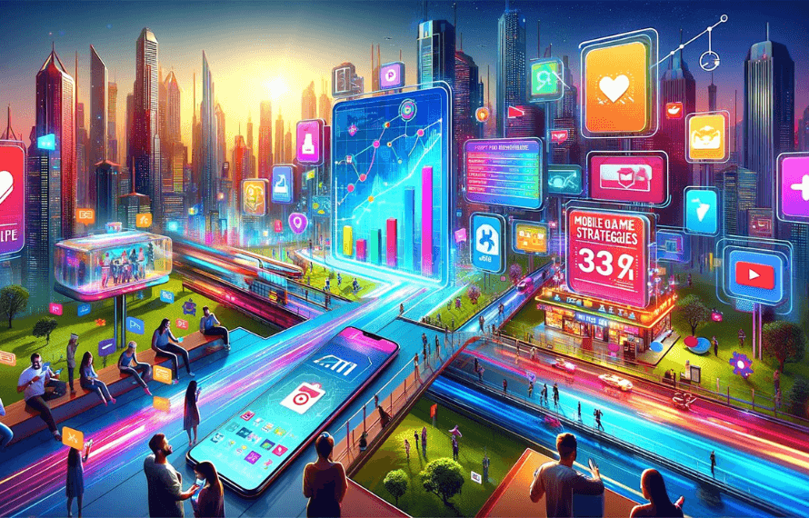
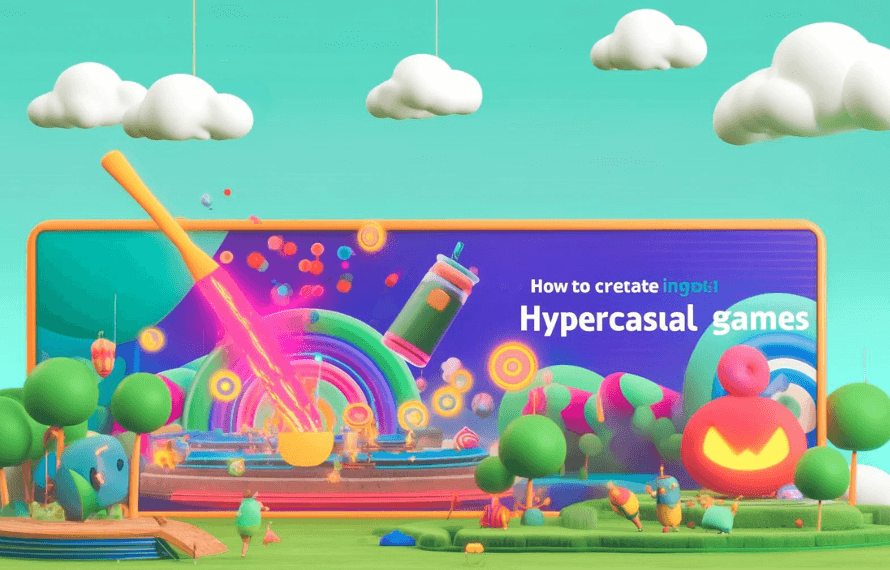
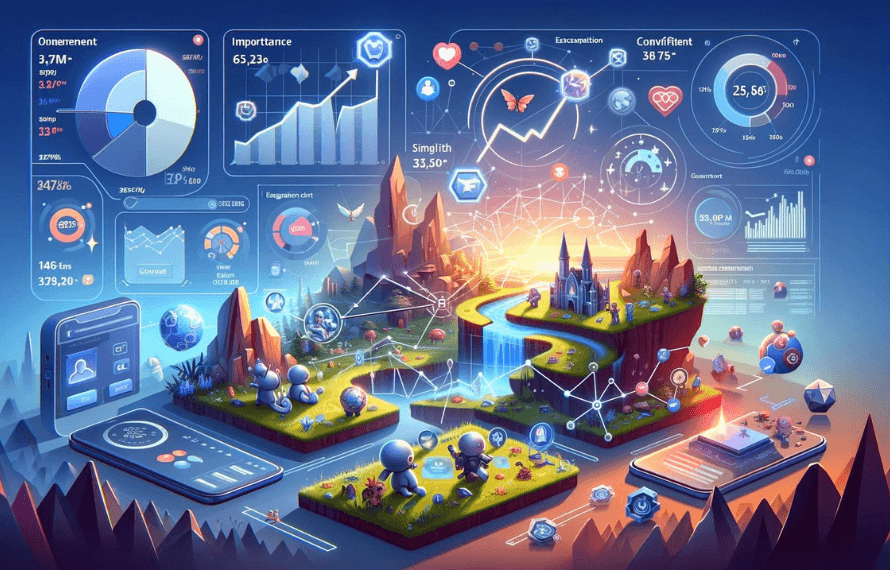

# September 2022 - Ramiz Trtovac

[8 800 2563 123](tel:+88002534236)

[contact@ramiztrtovac.com](mailto: contact@ramiztrtovac.com)

Twitter

Facebook-f

Google-plus-g

Pinterest-p

Linkedin-in

* [Home](https://ramiztrtovac.com/)
* [About Me](https://ramiztrtovac.com/about-me/)
* [Blog](https://ramiztrtovac.com/blog/)
* [Contact Me](https://ramiztrtovac.com/contact-me/)

Search

# September 2022

[Home](https://ramiztrtovac.com/)[2022](https://ramiztrtovac.com/2022/)  September

[](https://ramiztrtovac.com/useraquisition/top-5-mobile-game-marketing-strategies-for-2024/)

September 2, 2022by [Ramiz Trtovac](https://ramiztrtovac.com/author/admin/)[User Acquisition](https://ramiztrtovac.com/category/useraquisition/)

## [Top 5 Mobile Game Marketing Strategies for 2024](https://ramiztrtovac.com/useraquisition/top-5-mobile-game-marketing-strategies-for-2024/)

In the fast-paced world of mobile gaming, staying ahead with innovative marketing strategies is crucial. As we are almost at half of 2024, I want to share simple tips that can help you be better at user acquisition for your mobile game. Here are the top five marketing strategies you should consider to boost your mobile game’s success.

1. **Leveraging Social Media Influencers**

Social media influencers have a significant impact on consumer behavior, making them a powerful tool for mobile game marketing. By collaborating with influencers who have a strong following in the gaming community, you can reach a highly engaged audience, especially with smaller ones. You don’t need to pay thousands of dollars to pick an influencer. Choose influencers whose followers match your target demographic, or streamers who play similar genres of games you develop to achieve the best results.

**Tip:** Offer influencers early access to your game or exclusive content to share with their followers. This can create a buzz and drive initial downloads.

2. **Utilizing In-App Advertising**

In-app advertising allows you to reach potential players directly within other apps. With sophisticated targeting options, you can ensure your ads are seen by users who are likely to be interested in your game. Formats like interstitial ads, rewarded videos, and playable ads are particularly effective in capturing attention. More about them I will talk in dedicated blog posts or you can just Google AdMonetisation tips for mobile games and there is plenty of good articles to read online.

**Tip:** Focus on creating high-quality, engaging ad creatives that showcase your game’s unique features and gameplay experience.Then pick some of your partners like Unity which is most common since you are probably building your game on Unity engine and invest 50$ per day for starting campaigns.

3. **Optimizing App Store Listings (ASO)**

App Store Optimization (ASO) is essential for increasing your game’s visibility and download rates. This involves optimizing your app’s title, description, keywords, and visuals (icons, screenshots, and videos) to improve its ranking in app store search results. Think about your App Store page as a local shop in a busy street. How you can drive attention to millions of people to get in your store. That should be your mindset about it.

**Tip:** Regularly update your app store listing with new screenshots, videos, and user reviews to keep it fresh and appealing. Conduct keyword research to identify and use terms that potential players are searching for. For keyword research I recommend using external tools like AppTweak if you have some money to invest in it.

4. **Running Targeted Ad Campaigns**

Paid advertising campaigns on platforms like Facebook, Google, and TikTok can drive a significant number of downloads when executed correctly. Utilize the targeting options available to reach specific user segments based on demographics, interests, and behaviors. However, best results nowadays with targeting BROAD with no targeting since then you enable these networks to learn more on campaign performance during the campaign onboarding which is more popular called “Learning phase”.

**Tip:** Experiment with different ad formats (such as video ads, carousel ads, and interactive ads) and optimize your campaigns based on performance data. A/B testing various creatives and messages can help identify the most effective approach. If you don’t have a Creative development team then just go with image assets and a few videos. It will be enough for the start.

5. **Engaging with Your Community**

Building a loyal community around your game can lead to sustained success. Engage with your players through social media, forums, and in-game events. Respond to feedback, provide regular updates, and create a sense of belonging among your players. This is really important and I covered a bit more of this topic in one of my YouTube videos. Check it [here](https://www.youtube.com/watch?v=C9iGbIXhF70).

**Tip:** Host events like Q&A sessions, live streams, and competitions to keep your community active and invested in your game. Reward your loyal players with exclusive in-game items or early access to new features, and always reply on the feedback and improve stuff that players want. You are there because of them!

**Conclusion**

As the mobile gaming industry continues to grow, staying updated with the latest marketing strategies is essential. By leveraging social media influencers, utilizing in-app advertising, optimizing your app store listings, running targeted ad campaigns, and engaging with your community, you can effectively promote your mobile game in 2024. Remember, the key is to continuously adapt and refine your strategies based on what resonates best with your audience.

If you want to get more answers I am open to any question on my Discord server. You can join for free and [link is here](https://www.youtube.com/redirect?event=video_description&redir_token=QUFFLUhqbG0zb2tiSjl3SUFvSVY0c2ROdkdMeUVvU1J6Z3xBQ3Jtc0trd1Z4WkRrNlRKTktTVGtaU0Q3SGg0NFItOURCSjc2Rmc1VjBuLW5TeF81SVJYNmdMQlY5cXYzOGV4MkdwcUtpM2VkTl9VVnhSOFBXRk1odHI4MUk1YnpmbzRrc19qcTBLdDgtRHFvY2FScW5mTk4tSQ&q=https%3A%2F%2Fdiscord.gg%2F98N5j4HqZP&v=ZhQ9KcEHEKc). Thanks for reading!

[Read More](https://ramiztrtovac.com/useraquisition/top-5-mobile-game-marketing-strategies-for-2024/)

[Share](javascript:void(0))

[](https://ramiztrtovac.com/creatives/how-to-create-engaging-ad-creatives-for-hypercasual-games/)

September 2, 2022by [Ramiz Trtovac](https://ramiztrtovac.com/author/admin/)[Creatives](https://ramiztrtovac.com/category/creatives/)

## [Irresistible Ads: How to Craft Engaging Creatives for HyperCasual Game Success](https://ramiztrtovac.com/creatives/how-to-create-engaging-ad-creatives-for-hypercasual-games/)

Hypercasual games are known for their simple mechanics and instant playability, making them extremely popular among mobile gamers. I remember in 2018/19 eight of the top 10 games on the stores were Hypercasual. Today that is changed a bit, but this market is still very competitive. To stand out in this competitive market, creating engaging ad creatives is crucial. Here’s a step-by-step guide to help you craft compelling ads for your hypercasual game.

1. **Highlight the Core Gameplay**

The primary appeal of hypercasual games lies in their straightforward and addictive gameplay. Your ad should quickly showcase the core mechanics to capture the viewer’s attention. Highlight what makes your game fun and unique within the first few seconds. Player attention in this games is very short so you need to jump on their screens straight away with pure showcase of your mobile game. 

**Tip:** Use short, snappy clips that demonstrate the gameplay loop. Keep it simple and avoid overloading the viewer with too much information.

2. **Use Eye-Catching Visuals**

Visual appeal is a critical factor in grabbing attention. Use bright colors, bold graphics, and dynamic animations to make your ad stand out. The visuals should be clean and easily understandable at a glance.

**Tip:** Incorporate elements that match your game’s aesthetic and theme. Consistency in style helps build brand recognition and trust.

3. **Incorporate Interactive Elements**

Interactive ads, such as playable ads, allow users to experience a snippet of your game before downloading it. This can significantly increase engagement and conversion rates as users get a taste of the gameplay.

**Tip:** Design a mini-version of your game that can be played within the ad. Make sure it’s intuitive and provides a satisfying experience to entice users to download the full game. If your budget allows, ping me to help you find the best partner to develop your highest quality playable ads. 

4. **Add a Clear Call-to-Action (CTA)**

A strong call-to-action directs viewers on what to do next, whether it’s downloading the game, watching a trailer, or visiting your website. The CTA should be clear, concise, and compelling.

**Tip**: Use action-oriented language such as “Play Now,” “Download Free,” or “Try It Today.” Ensure the CTA button is prominently displayed and easy to tap. However, sometimes I see nowadays some Publishers don’t even use it, but I always recommend using them. 

5. **Test Different Variations**

Creating multiple variations of your ad creatives allows you to test and see which ones perform best. Experiment with different visuals, messages, and formats to identify the most effective combination.

**Tip:** Use A/B testing to compare the performance of different ad versions. Pay attention to metrics like click-through rates (CTR), conversion rates, and user retention to determine success. Most crucial metric to follow Ad performance is IPM, you can find more about it on UA Glossary but here is a short explanation. IPM = Installs per mille. 

6. **Leverage User-Generated Content**

User-generated content (UGC) can add authenticity and trust to your ads. Showcasing real players enjoying your game or sharing their experiences can create a relatable and convincing message.

**Tip:** Encourage your players to share their gameplay videos or reviews. Feature these clips in your ads to build a sense of community and trust. If you don’t have an internal creative team to develop you UGC ads, ping me to connect you with some great people from the industry to develop them.

**Conclusion**

Creating engaging ad creatives for hypercasual games requires a focus on simplicity, visual appeal, and interactivity. By highlighting the core gameplay, using eye-catching visuals, incorporating interactive elements, adding a clear call-to-action, testing different variations, and leveraging user-generated content, you can craft compelling ads that drive downloads and increase player engagement.

If you want to get more answers I am open to any question on my Discord server. You can join for free and [link is here](https://www.youtube.com/redirect?event=video_description&redir_token=QUFFLUhqbG0zb2tiSjl3SUFvSVY0c2ROdkdMeUVvU1J6Z3xBQ3Jtc0trd1Z4WkRrNlRKTktTVGtaU0Q3SGg0NFItOURCSjc2Rmc1VjBuLW5TeF81SVJYNmdMQlY5cXYzOGV4MkdwcUtpM2VkTl9VVnhSOFBXRk1odHI4MUk1YnpmbzRrc19qcTBLdDgtRHFvY2FScW5mTk4tSQ&q=https%3A%2F%2Fdiscord.gg%2F98N5j4HqZP&v=ZhQ9KcEHEKc). Thanks for reading!

[Read More](https://ramiztrtovac.com/creatives/how-to-create-engaging-ad-creatives-for-hypercasual-games/)

[Share](javascript:void(0))

[](https://ramiztrtovac.com/useraquisition/the-importance-of-user-acquisition-in-mobile-gaming-a-simplified-guide/)

September 2, 2022by [Ramiz Trtovac](https://ramiztrtovac.com/author/admin/)[User Acquisition](https://ramiztrtovac.com/category/useraquisition/)

## [The Importance of User Acquisition in Mobile Gaming: A Simplified Guide](https://ramiztrtovac.com/useraquisition/the-importance-of-user-acquisition-in-mobile-gaming-a-simplified-guide/)

In the highly competitive world of mobile gaming, user acquisition (UA) is the lifeblood of success. Understanding and implementing effective UA strategies can make the difference between a game that thrives and one that fades into obscurity. This simplified guide will help you navigate the confusing world of user acquisition in the mobile gaming industry.

**What is User Acquisition?**

User acquisition refers to the process of attracting and converting users to download and engage with your mobile game. It involves various marketing tactics and channels aimed at reaching potential players and encouraging them to install your game.

**Why is User Acquisition Important?**

TLDR: Increased Downloads: Effective UA strategies drive more downloads, expanding your player base and increasing the potential for in-app purchases and ad revenue.

**Revenue Growth**: More users mean more opportunities for monetization. Whether through ads, in-app purchases, or premium features, a larger user base can significantly boost your game’s revenue.

**Game Longevity:** Continuous user acquisition efforts help maintain a steady influx of new players, ensuring the game remains active and vibrant over time.

**Key User Acquisition Tactics**

**Social Media Advertising**

Social media platforms like Facebook, Instagram, and TikTok offer powerful advertising tools with precise targeting options. You can reach specific demographics, interests, and behaviors, making it easier to find and engage potential players.

**Tip:** Create engaging and visually appealing ad creatives that resonate with your target audience. Utilize video ads to showcase gameplay and highlight unique features. 

**Influencer Marketing**

Collaborating with micro influencers in the gaming community can provide authentic endorsements and reach a highly engaged audience. Micro Influencers can create content around your game, such as reviews, tutorials, or live streams, generating interest and driving downloads.

**Tip:** Choose micro influencers whose audience aligns with your target demographic. Offer them early access or exclusive content to share with their followers. Most of them will accept it since they are not so big and sometimes they don’t even know what to play or stream. 

**App Store Optimization (ASO)**

ASO is crucial for improving your game’s visibility in app store search results. Optimize your app’s title, description, keywords, and visuals to attract more organic downloads.

**Tip:** Regularly update your app store listing based on user feedback and performance data. Use A/B testing to determine the most effective visuals and descriptions.

**Paid Advertising Campaigns**

Platforms like Google Ads, Apple Search Ads, and various ad networks allow you to run targeted ad campaigns to promote your game. These campaigns can drive significant traffic and downloads when executed properly.

**Tip:** Experiment with different ad formats (e.g., banners, interstitials, videos) and continuously optimize your campaigns based on performance metrics. Utilize retargeting to re-engage users who have shown interest but haven’t downloaded the game.

**Partnerships and Cross-Promotions**

Partnering with other game developers or apps for cross-promotions can be a cost-effective way to reach new users. You can promote each other’s games to your respective user bases, benefiting both parties.

**Tip:** Look for partners whose games or apps complement yours. Ensure the cross-promotion is mutually beneficial and aligns with your brand values. You can find them on LinkedIn, just publish a post and someone will recommend someone else with the same need. Simple as that. 

**Measuring and Optimizing User Acquisition**

**Tracking Key Metrics**

Monitor key performance indicators (KPIs) such as cost per install (CPI), retention rate, lifetime value (LTV), and return on ad spend (ROAS) to calculate the effectiveness of your UA efforts.

**Tip**: Use analytics tools to track these metrics and gain insights into user behavior. Adjust your strategies based on data to improve performance. More about analytic tools you can find on my recent YouTube video. [Watch it here.](https://www.youtube.com/watch?v=5_TtEFhz6d4)

**A/B Testing**

A/B testing different ad creatives, messaging, and targeting options helps identify what works best for your audience. This iterative process allows for continuous improvement and optimization.

**Tip:** Test one variable at a time to accurately measure its impact. Use the insights gained to refine your UA strategies and most crucial is to define your success metric. Not every metric is important for your category. If you are in the Hypercasual world then watch the IPM (Install per mille), if you are in RPG watch the Retention rather then IPM only. 

**User Feedback**

Collect and analyze feedback from your players to understand their preferences and pain points. This information can guide your UA strategies and game development efforts.

**Tip:** Encourage users to leave reviews and ratings on app stores. Engage with your community through social media, forums, and in-game surveys to gather valuable insights. This is very important and often overlooked even by some mid-sized game studios. 

**Conclusion**

User acquisition is a critical component of mobile game success. By leveraging social media advertising, influencer marketing, app store optimization, paid advertising campaigns, and partnerships, you can effectively attract and retain players. Regularly measure and optimize your efforts to ensure sustained growth and profitability in the competitive mobile gaming market.

If you want to get more answers I am open to any question on my Discord server. You can join for free and [link is here](https://www.youtube.com/redirect?event=video_description&redir_token=QUFFLUhqbG0zb2tiSjl3SUFvSVY0c2ROdkdMeUVvU1J6Z3xBQ3Jtc0trd1Z4WkRrNlRKTktTVGtaU0Q3SGg0NFItOURCSjc2Rmc1VjBuLW5TeF81SVJYNmdMQlY5cXYzOGV4MkdwcUtpM2VkTl9VVnhSOFBXRk1odHI4MUk1YnpmbzRrc19qcTBLdDgtRHFvY2FScW5mTk4tSQ&q=https%3A%2F%2Fdiscord.gg%2F98N5j4HqZP&v=ZhQ9KcEHEKc). Thanks for reading!

[Read More](https://ramiztrtovac.com/useraquisition/the-importance-of-user-acquisition-in-mobile-gaming-a-simplified-guide/)

[Share](javascript:void(0))

###### Send Me a Message

contact@ramiztrtovac.com

###### Location

Belgrade, Serbia

#### Connect with me

Feel free to add me on LinkedIn where and ping me anything related to your mobile game growth success.

[Linkedin](https://www.linkedin.com/in/ramiz-trtovac/) 

[Youtube](https://www.youtube.com/@RamizTrtovac)

#### Content

* [Home](https://ramiztrtovac.com/)
* [About Me](https://ramiztrtovac.com/about-me/)
* [Blog](https://ramiztrtovac.com/blog/)
* [Contact Me](https://ramiztrtovac.com/contact-me/)

#### Community

Free Discord

[Discord](https://discord.gg/6VesmRtQsg)

#### Quick Links

* [Home](https://ramiztrtovac.com/)
* [About Me](https://ramiztrtovac.com/about-me/)
* [Blog](https://ramiztrtovac.com/blog/)
* [Contact Me](https://ramiztrtovac.com/contact-me/)

Ramiz Trtovac © 2024 — All Rights Reserved. Developed by Pick&Flow.

Claritas est etiam processus dynamicus, qui sequitur mutationem consuetudium lecto rum eleifend option congue nihil doming. Espa notrle neumurit.

#### Categories

* [Creatives](https://ramiztrtovac.com/category/creatives/)
* [User Acquisition](https://ramiztrtovac.com/category/useraquisition/)

#### Contacts

8 800 2563 123

emil@yoursite.com

27 Division St, New York, NY 10002, United States

[Back to top](javascript:void(0))